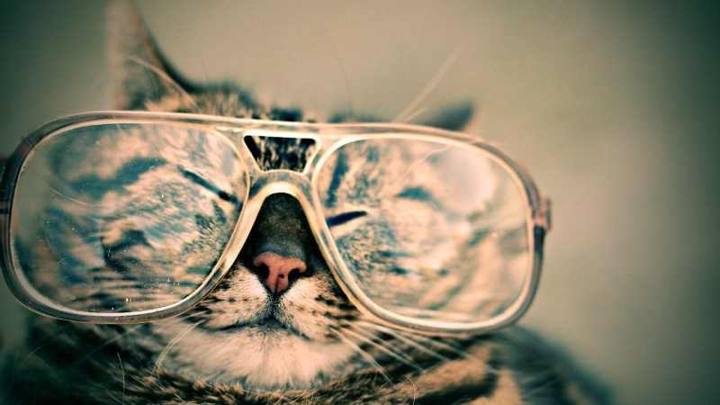
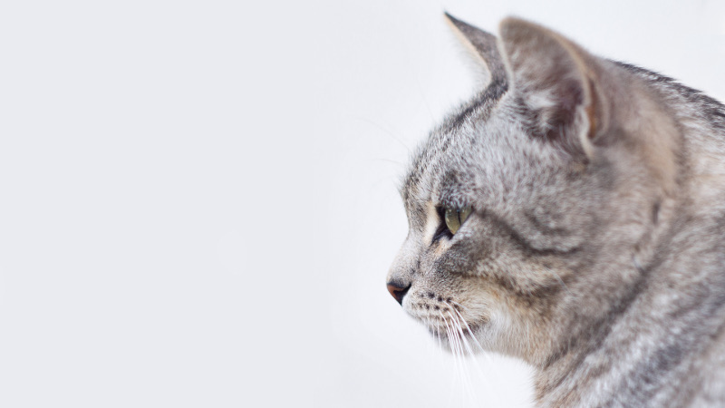
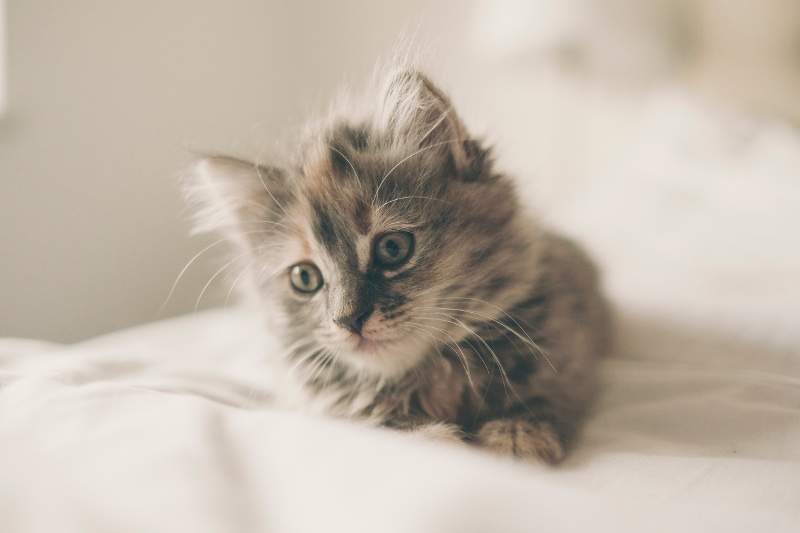
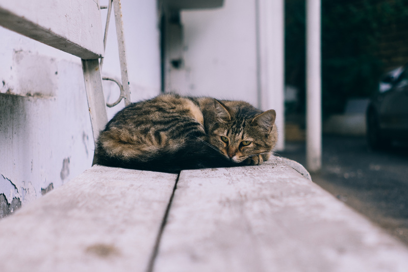

# Simple responsive flexible layout demo by programming mentor

## Step 01 - Prepare 

Create `index.html` file:

```html
<!DOCTYPE html>
<html lang="en">
<head>
    <meta charset="UTF-8">
    <title>Simple Responsive Flexbox Layout Example</title>
</head>
<body>
    
</body>
</html>
```

Add to the `head` section following meta instruction for mobile browsers [see details on MDN website](https://developer.mozilla.org/en/docs/Mozilla/Mobile/Viewport_meta_tag):

```html
<meta name="viewport" content="width=device-width, initial-scale=1">
``` 

## Step 02 - Add content

Create folder `img` and add image files to this folder:
```
cat-background.jpg
cat1.jpg
cat2.jpg
cat3.jpg
cat4.jpg
```

In the file `index.html` create semantic blocks:

```html
<header>

</header>
<main>
    <nav>

    </nav>
    <article>

    </article>
    <aside>

    </aside>
</main>
<footer>

</footer>
``` 

Fill blocks with content:

```html
<header>
    <h1>Cats</h1>
</header>
<main>
    <nav>
        <ul>
            <li><a href="#intro">Intro</a></li>
            <li><a href="#breeding-rate">Breeding rate</a></li>
            <li><a href="#popularity">Popularity</a></li>
        </ul>
    </nav>
    <article>
        <h2 id="intro">Intro</h2>
        <p>The domestic cat[1][5] (Latin: Felis catus) is a small, typically furry, carnivorous mammal. They are often called
            house cats when kept as indoor pets or simply cats when there is no need to distinguish them from other felids
            and felines.[6] Cats are often valued by humans for companionship and for their ability to hunt vermin. There
            are more than 70 cat breeds; different associations proclaim different numbers according to their standards.</p>
        <p>Cats are similar in anatomy to the other felids, with a strong, flexible body, quick reflexes, sharp retractable
            claws, and teeth adapted to killing small prey. Cat senses fit a crepuscular and predatory ecological niche.
            Cats can hear sounds too faint or too high in frequency for human ears, such as those made by mice and other
            small animals. They can see in near darkness. Like most other mammals, cats have poorer color vision and
            a better sense of smell than humans. Cats, despite being solitary hunters, are a social species and cat communication
            includes the use of a variety of vocalizations (mewing, purring, trilling, hissing, growling, and grunting),
            as well as cat pheromones and types of cat-specific body language.[7]</p>
        <h2 id="breeding-rate">Breeding rate</h2>    
        <p>Cats have a high breeding rate.[8] Under controlled breeding, they can be bred and shown as registered pedigree
            pets, a hobby known as cat fancy. Failure to control the breeding of pet cats by neutering and the abandonment
            of former household pets has resulted in large numbers of feral cats worldwide, requiring population control.[9]
            In certain areas outside cats' native range, this has contributed, along with habitat destruction and other
            factors, to the extinction of many bird species. Cats have been known to extirpate a bird species within
            specific regions and may have contributed to the extinction of isolated island populations.[10] Cats are
            thought to be primarily, though not solely, responsible for the extinction of 33 species of birds, and the
            presence of feral and free ranging cats makes some locations unsuitable for attempted species reintroduction
            in otherwise suitable locations.[11] Stephen J. O'Brien argues that feline immunodeficiency virus (FIV),
            a disease not so different from HIV was found in house cats. Interestingly, over eight free-ranging wild
            species of Felidae are infected with their own species-specific FIV strain (based on FIV gene sequence monophyly)
            that in most cases seems to be attenuated by historic selection of genetically resistant survivors in today’s
            wild places.[12] Since cats were venerated in ancient Egypt, they were commonly believed to have been domesticated
            there,[13] but there may have been instances of domestication as early as the Neolithic from around 9,500
            years ago (7,500 BC).[14] A genetic study in 2007 concluded that domestic cats are descended from Near Eastern
            wildcats, having diverged around 8,000 BC in West Asia.[13][15] A 2016 study found that leopard cats were
            undergoing domestication independently in China around 5,500 BC, though this line of partially domesticated
            cats leaves no trace in the domesticated populations of today.[16][17]</p>
        <h2 id="popularity">Popularity</h2>    
        <p>As of a 2007 study, cats are the second most popular pet in the US by number of pets owned, behind freshwater
            fish.[18] In a 2010 study they were ranked the third most popular pet in the UK, after fish and dogs, with
            around 8 million being owned.[19]</p>
        <p>Source: <a href="https://en.wikipedia.org/wiki/Cat">https://en.wikipedia.org/wiki/Cat</a></p>
    </article>
    <aside>
        <div></div>
        <div></div>
        <div></div>
        <div></div>
    </aside>
</main>
<footer>
    <p>Simple responsive flexbox layout demo by <a href="http://programmingmentor.com">programming mentor</a></p>
</footer>
```

## Step 03 - Add styles

Also create folder `css` and place empty file `index.css` into it, add link to `css/index.css` in `head` section of `index.html` file: 

```html
<link href="css/index.css" rel="stylesheet">
```

In the file `css/index.css` add styles. Please note that we used `display: flex;` property to center text in header.

```css
* {
    margin: 0;
}
body {
    max-width: 1200px;
    margin: 0 auto;
    font-family: sans-serif;
    font-size: 0.875em;
    line-height: 1.6em;
}

header {
    background-image: url("../img/cat-background.jpg");
    background-position: center center;
    background-size: cover;
    height: 300px;
    display: flex;
    align-items: center;
    justify-content: flex-start;
    padding-left: 10%;
}

header h1 {
    font-size: 10rem;
    color: white;
}

article {
    padding: 10px;
}

nav ul { 
    list-style-type: none;
    list-style-position: inside;
    margin: 0;
    padding: 10px; 
}

aside img {
    display: block;
    width: 100%;
}

footer p {
    text-align: center;
}
```

## Step 04 - Add layout

In the folder `css` create file `index-layout.css`, add link to it in `head` section of `index.html` file: 

```html
<link href="css/index-layout.css" rel="stylesheet">
```

We will create simple layout with `header` at top, `footer` at bottom and `main` section split to three columns - `nav`, `article` and `aside`.
We will create layout using `flexbox`.
At first, we tell `main` section to use `flexbox` with `display: flex` property, then we should split width between our columns. 
For `nav` section we will use default width, it will take as much space as needed to show content.
For `aside` we will tell to use at least 40% of the width of parent container and rest of the space will be provided for article. 

Here how our layout styles will look like in `css/index-layout.css`:

```css
main {
    display: flex;
}
main aside {
    min-width: 40%;
} 
```

To let our website adapt to small screens we will add `media query` directive and set a limit when layout should be changed.


For small screens we will use `media query` and add following styles:

```css
@media screen and (max-width: 720px) {
    header {
        height: 200px;        
    }
    header h1 {
        font-size: 5rem;
    }

    aside {
        display: flex;
        flex-wrap: wrap;
    }
    aside div {
        flex-basis: 50%;
    }
   
    main {
        flex-wrap: wrap;
    }
    main article {
        order: 1;
    }
    main nav {
        order: 3;
    }
    main aside {
        order: 2;
    }
}
```

For extra small screens we add modifications to let images take full width of the screen:

```css
@media screen and (max-width: 450px) {
    aside div {
        flex-basis: 100%;
    }
}
```

See working demo: [http://programmingmentor.github.io/simple-flexbox-responsive-layout-tutorial](http://programmingmentor.github.io/simple-flexbox-responsive-layout-tutorial)